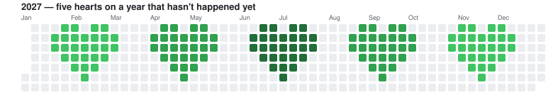

## ⏳ You're looking at the past. Scroll down for it — but 2027 already happened here.

<picture>
  <source media="(prefers-color-scheme: dark)" srcset="assets/graph-2027-dark.svg">
  
</picture>

Five hearts, committed to the future. GitHub unlocks the 2027 button on New Year's Day —
**[or see it live right now →](https://github.com/Nightwolf7570?tab=overview&from=2027-01-01&to=2027-12-31)**

The calendar escaped the plane. **[Open it in GitHub's native 3D viewer, then drag to rotate →](assets/commit-hearts.stl)**

<!-- capsule v2 -->
